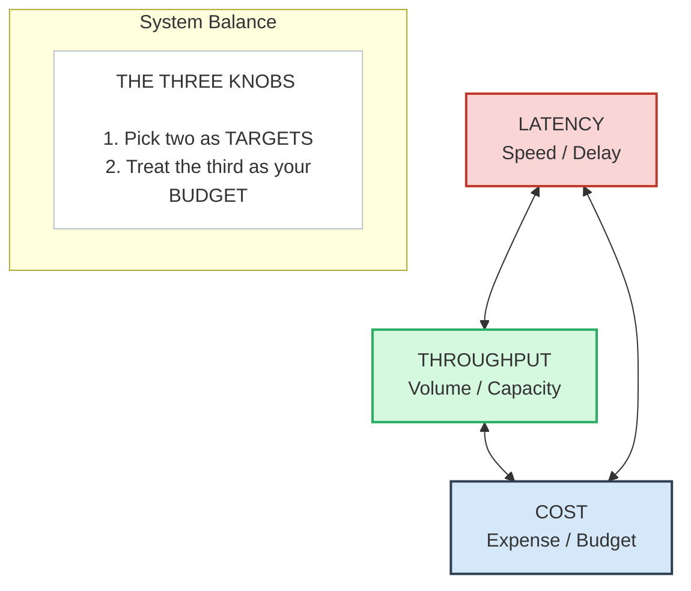

# Architecture Justification: Scenario B (Weekly Churn Predictions)

This document provides the architectural justification for the B2B SaaS Churn Prediction system, addressing serving patterns, compute location, trade-offs, and failure modes.

---

## 1. Serving Pattern Selection & Business Alignment

We have selected the **Batch (Offline) Serving Pattern** for this system. This decision is strictly tied to the following constraints in the business prompt:

* **No Real-Time Requirement:** The scenario explicitly states that the sales team requires the ranked list of accounts at risk **"every Monday morning"** and that the score **"only needs to refresh weekly."** Since no user is waiting for a live prediction on a screen, an online API pattern would be a massive over-engineering.
* **Stable Inputs:** Customer churn indicators in a B2B SaaS context (such as subscription status from Stripe or ticket counts from Zendesk) change over days, not seconds. 
* **Data Locality:** To score churn, the model needs a holistic view of the account's history. This heavy aggregation is best performed directly inside the Data Warehouse via scheduled batch queries rather than streaming event handlers.

---

## 2. Inference Location (Cloud vs. Edge)

Inference will run entirely in the **Cloud** (specifically utilizing ephemeral cloud compute triggered by an orchestrator like Apache Airflow or AWS Step Functions).

* **Why Cloud?** In a B2B SaaS system, all the core customer data sits in centralized databases and cloud tools (Stripe, Zendesk, App databases). Bringing this data down to an "edge" device makes no sense. The data and the model must live together in the cloud data center.
* **Resource Efficiency:** We will use serverless compute (e.g., AWS ECS Fargate or Snowflake-native Python sheets). This allows us to spin up powerful CPU/GPU nodes on Sunday night, process the scores, and shut them down immediately after completion. We pay only for the exact minutes the batch job runs.

---

## 3. The Three Knobs: Latency, Throughput, and Cost

Every architecture must balance these three competing forces. For this system, we have configured the dials as follows:

1. **Optimize - Throughput:** The system must process **~120,000 accounts** concurrently. The infrastructure is optimized to stream large tables from the database into the model efficiently using vectorized chunks.
2. **Optimize - Cost:** By choosing a batch pattern, we minimize operational costs. We completely avoid running 24/7 online inference servers, load balancers, or auto-scaling groups. Compute cost is restricted to a single weekly window.
3. **The Budget - Latency:** Latency is our **sacrificial budget**. It does not matter if a single account prediction takes 500 milliseconds or if the entire batch job takes 3 hours to finish. Our only hard boundary is that the job must complete within a 6-hour window on Sunday night (e.g., between 12:00 AM and 6:00 AM) so the data is fresh when the sales team logs in.

---

## 4. Fallback and Resiliency Strategy

In production, models will eventually fail or produce wrong outputs. Our system handles this through a graceful degradation strategy:

### When the Model/Pipeline is Unavailable (Sunday Night Crash):
* **Operational Fallback:** If the Sunday night batch job fails due to an upstream database issue or code error, the system triggers a critical alert via PagerDuty. 
* **Graceful Degradation:** The Reverse ETL sync to Salesforce will be blocked from running empty data. Instead, the CRM dashboard will continue to display the **previous week's scores**. A UI banner will be injected at the top of the dashboard stating: *"Data as of last week. Current week refresh is delayed."* Because sales workflows span multiple days, 7-day-old data is perfectly acceptable for Monday morning outreach until the data engineers manually re-run the pipeline.

### When the Model is Wrong (False Positives/Negatives):
* **Human-in-the-Loop Feedback:** Churn is a probabilistic guess. If the model flags a healthy account as "High Risk" (False Positive), the sales rep can click a **"Mark as Safe"** button directly inside Salesforce.
* **Data Capture:** This action logs a telemetry event back into the Data Warehouse. This human feedback acts as immediate override protection for the sales team and provides vital ground-truth labels for the next monthly retraining cycle.